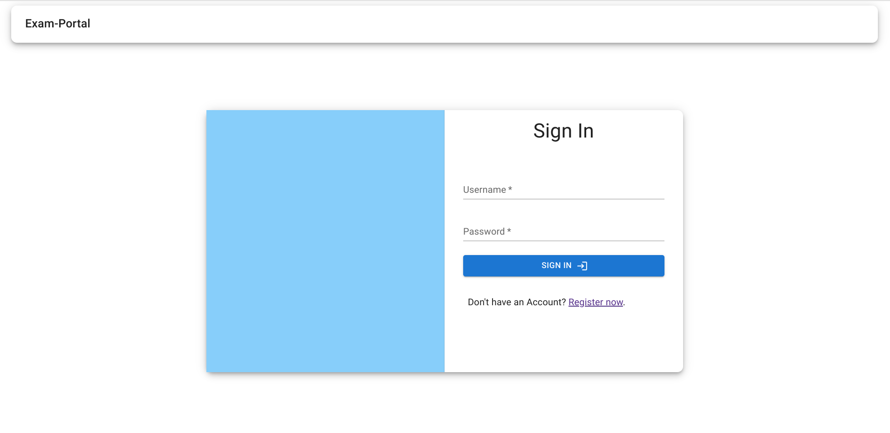
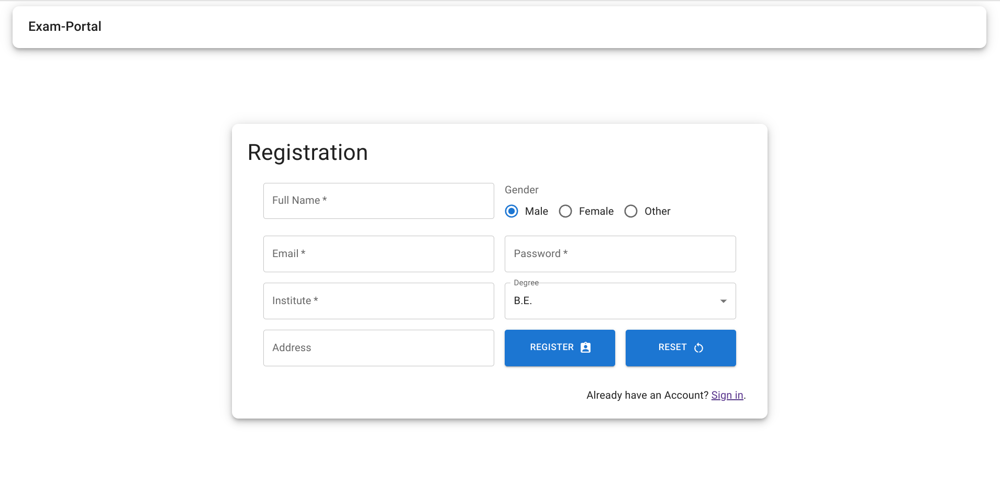
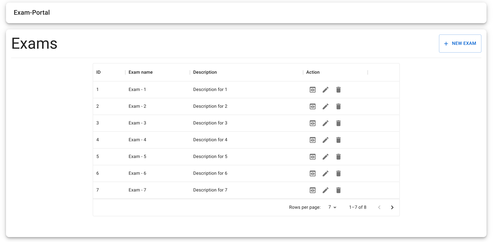
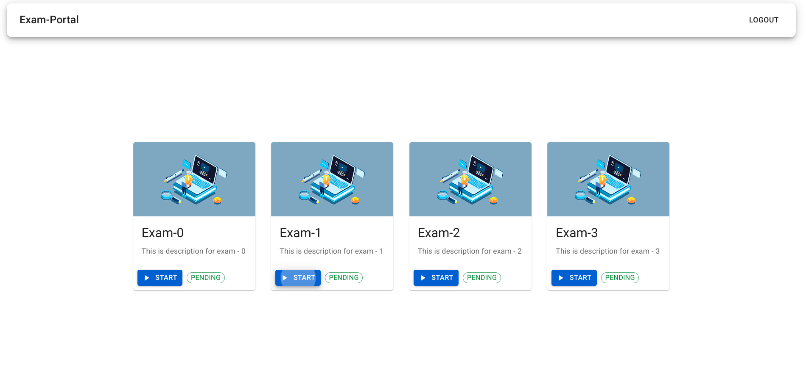
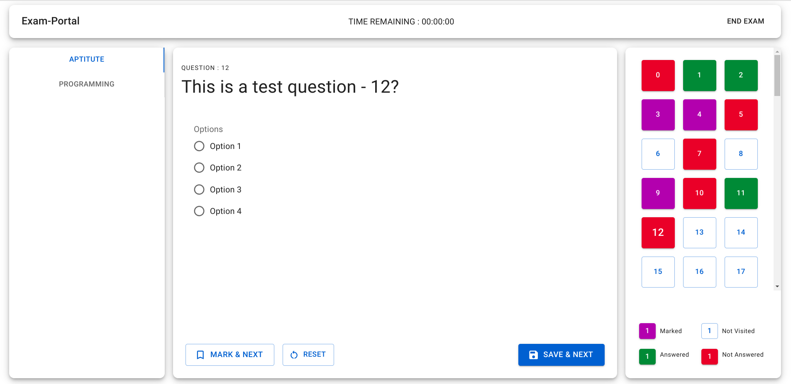

# Online Exam System - Frontend 
This is a frontend repository for the Online Exam System! This project provides the user interface for interacting with the Online Exam System backend. Here, you'll find all the necessary components and functionalities for both administrators and exam takers.


## Getting Started

To get a local copy up and running, follow these simple steps:

1. Clone the repository.
   ```bash
   git clone https://github.com/shubham225/exam-system-backend.git
2. Navigate to the project directory.
    ```bash
   cd exam-system-frontend
3. Install Dependencies.
    ```bash
   npm install
4. Run the Development Server.
    ```bash
   npm start
5. Open your browser and navigate to `http://localhost:3000` to access the Online Exam System frontend.


## UI Screenshot



### Admin Login


### Student Login



## License

This project is licensed under the [MIT License](LICENSE.md).