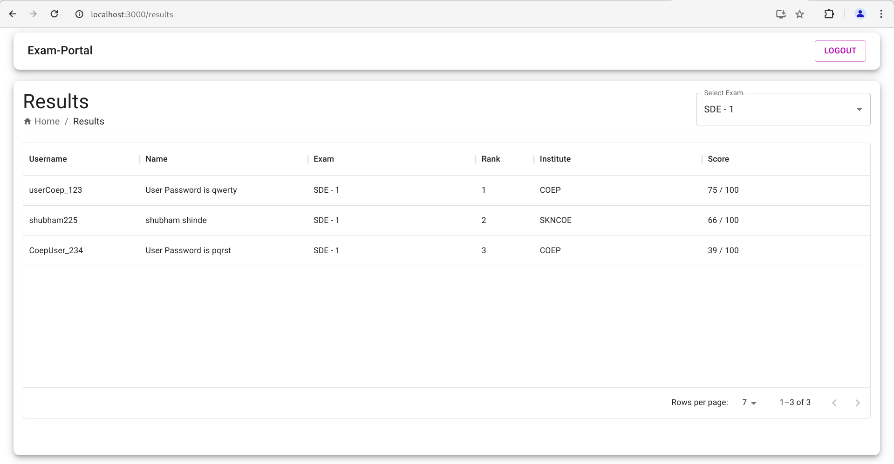
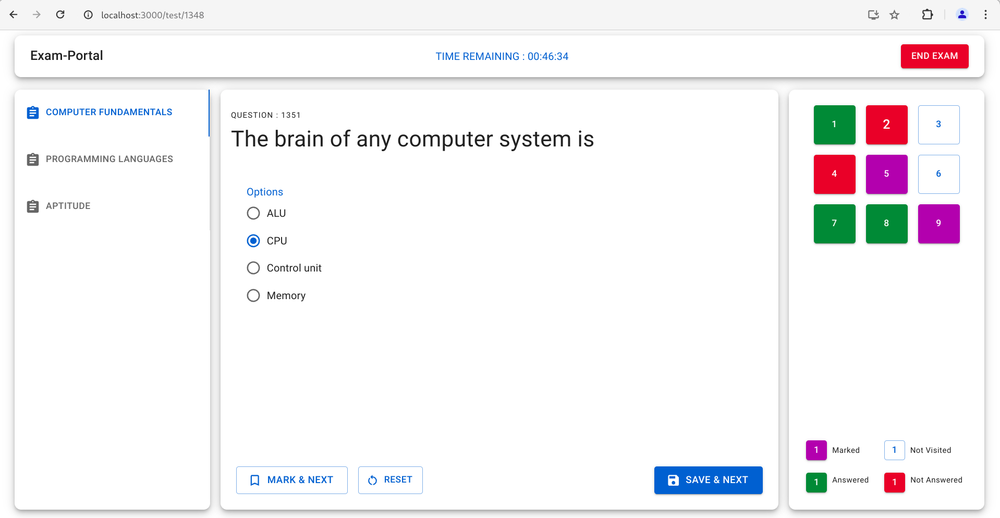

# Online Exam System - Frontend 
The Online Exam System Frontend is a React-based web application designed to facilitate online exams. This project provides a user-friendly interface for students to take exams and for administrators to manage them.


## Features
- User Authentication
- Dashboard for students and administrators
- Exam management (create, update, delete exams)
- Question management (add, edit, delete questions)
- Real-time exam submission
- Result analysis

## Screenshots
*Login Page*

*Registration Page*


<!-- ### Admin Login -->
*Admin Dashboard*

*Exam Management Page*

*Assign Exam Page*

*Result Page*


<!-- ### Student Login -->
*Student Page*

*Exam Page*


## Installation

### Prerequisites
- Node.js (>= 14.0.0)
- npm (>= 6.0.0) or yarn (>= 1.22.0)

### Steps
1. **Clone the repository**
    ```bash
    git clone https://github.com/shubham225/exam-system-frontend.git
    cd exam-system-frontend
    ```

2. **Install dependencies**
    ```bash
    npm install
    # or
    yarn install
    ```

3. **Run the application**
    ```bash
    npm start
    # or
    yarn start
    ```

4. **Build the application for production**
    ```bash
    npm run build
    # or
    yarn build
    ```

## Usage
After starting the application, open your browser and navigate to `http://localhost:3000`. You will be presented with the login screen. Register a new account or log in with existing credentials to access the dashboard.

## License
This project is licensed under the MIT License - see the [LICENSE](LICENSE.md) file for details.